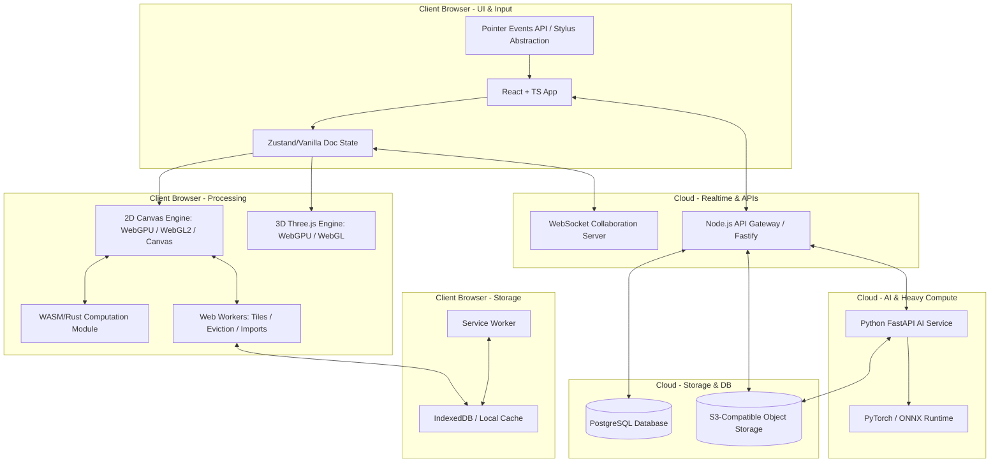
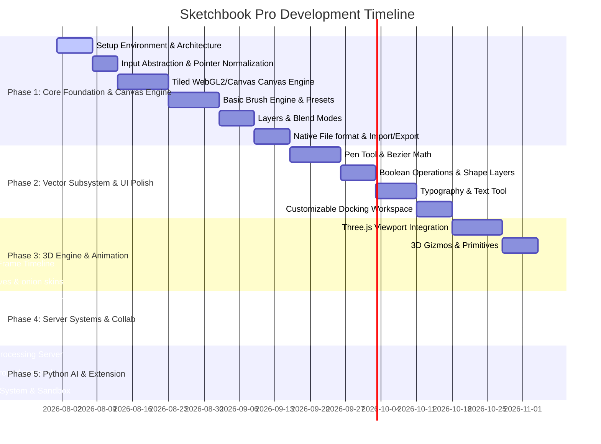

# Sketchbook Pro (ArtStudio)

A professional-grade, browser-based creative software platform combining digital painting, vector illustration, 2D animation, 3D scene composition, image editing, and real-time collaboration into a unified creative operating environment.

---

## 🗺️ System Architecture Overview

The system is designed as a hybrid modular architecture to ensure maximum rendering performance, low input latency, scalable AI execution, and secure extensibility.



---

## 🏗️ Architectural Specification

### 1. Frontend Architecture
- **Framework**: React 19 + TypeScript + Vite.
- **State Management**: React handles application shell UI state, while the **Document Model State** is managed using an independent vanilla TypeScript store (minimizing React render cycles on mouse-move/draw events).
- **Styling**: Vanilla CSS (CSS variables, flexbox, grid, glassmorphism, dark/light themes) tailored for dense, customizable docking panel layouts.
- **Directory Structure**:
  ```text
  /frontend
  ├── src/
  │   ├── assets/           # Fonts, static UI assets
  │   ├── components/       # UI Shell, Panels, Workspace components
  │   ├── engine/           # 2D & 3D rendering engines, inputs, WASM bridges
  │   │   ├── canvas/       # 2D rendering pipeline (WebGPU/WebGL2/Canvas)
  │   │   ├── input/        # Stylus & pointer normalization layer
  │   │   ├── brush/        # Preset calculations & stabilizers
  │   │   └── three/        # Three.js 3D environment
  │   ├── state/            # Document model & application states
  │   └── main.tsx
  ```

### 2. Rendering Architecture (WebGPU + WebGL2 + Canvas Fallback)
- **Primary WebGPU**: Utilizes modern compute and render pipelines for hardware-accelerated brush stroke processing, layer blending, and filter effects.
- **Fallback WebGL2**: Translates WebGPU shaders or uses a dedicated WebGL2 rendering pipeline where WebGPU is not supported.
- **Fallback 2D Canvas**: Pure CPU/2D Context fallback for ultra-legacy systems, ensuring basic draw/paint tools remain operational.
- **OffscreenCanvas**: Moves rendering calculations to dedicated Web Workers, preventing the main thread (UI) from blocking during intensive drawing operations.

### 3. Document Model
- **Core Concept**: The document model is an abstract data tree representing layers, vectors, 3D scenes, timelines, and metadata. It runs entirely outside of React's lifecycle.
- **Structure**:
  ```typescript
  interface DocumentModel {
    id: string;
    version: number;
    metadata: DocumentMetadata;
    canvas: CanvasSettings; // Width, Height, DPI, ColorSpace
    layers: LayerNode[];     // Tree hierarchy (Raster, Vector, Group, Adjustment, etc.)
    threeDScene?: ThreeDSceneState;
    timeline?: AnimationTimelineState;
    assets: AssetRegistry;
  }
  ```
- **Serialization**: Can be completely serialized into JSON and binary buffers for local and cloud saves.

### 4. Canvas Engine Architecture
- **Tiled Rendering**: Divide large canvases (e.g., 8000x8000 pixels) into standard 256x256 tiles. Only modify and redraw tiles that intersect the active stroke's bounding box.
- **Dirty Region Tracking**: Maintain bounding boxes of modifications ("dirty rects") to only update the screen where changes occurred, keeping frame rates at a constant 60fps.
- **LRU Texture Cache**: Keep frequently accessed tiles in GPU memory. Evict inactive tiles to RAM/IndexedDB when exceeding GPU memory limits.

### 5. Brush Engine Architecture
- **Stroke Computation**: Brushes are represented as procedural equations and stamp textures. High-speed coordinate generation is offloaded to WebAssembly.
- **Parameters**: Dynamic mapping of brush attributes (Size, Opacity, Flow, Scatter, Jitter, Wetness, Color Mixing) based on pressure, tilt, velocity, and tilt-angle.
- **Brush Presets**: Importable/exportable JSON format defining stamp shapes, dual-brush configurations, and mapping curves.

### 6. Stylus/Input Abstraction
- **Normalization Layer**: Absorbs raw browser PointerEvents and normalizes stylus-specific attributes:
  ```typescript
  interface StylusInput {
    x: number;
    y: number;
    pressure: number;     // Normalized 0.0 - 1.0
    tiltX: number;        // Radians
    tiltY: number;        // Radians
    twist: number;        // Rotation in radians
    pointerType: 'pen' | 'mouse' | 'touch';
    timestamp: number;
  }
  ```
- **Stabilization Algorithms**:
  - *Lazy Mouse / Rope*: Follows the cursor with an offset string length to smooth out hand tremors.
  - *Exponential Smoothing*: Moving-average filter over pointer history.

### 7. Color-Management Architecture
- **Supported Workspaces**: sRGB, Display P3, linear-RGB, and wide-gamut HDR profiles.
- **Color Representation**: Uses OKLCH and OKLab for perceptually uniform color adjustments, alongside traditional RGB, HSL, CMYK, and LAB models.
- **Precision**: Supports 8-bit, 16-bit integer, and 32-bit float channels per color component to prevent banding in professional workflows.

### 8. Layer Architecture
- **Composition Pipeline**: Combines layers using WebGPU compute shaders / WebGL fragment shaders in a non-destructive hierarchy.
- **Layer Types**:
  - **Raster Layer**: Binary pixel buffers stored in tiled grid arrays.
  - **Vector Layer**: Path definitions, bezier handles, styling data.
  - **Group Layer**: Folders containing child layers with group-level blend/clipping configurations.
  - **Adjustment Layer**: Live non-destructive filters (Exposure, Curves, Hue/Sat) applied downstream.
  - **Masks**: Alpha masks, vector masks, and clipping paths associated with any layer type.
- **Blend Modes**: Implements exact math formulas for Normal, Multiply, Screen, Overlay, Color Dodge/Burn, etc.

### 9. Animation Architecture
- **Frame-by-Frame**: Playback controlled by an FPS-based timer. Layers can map to specific keyframe nodes on the timeline.
- **Timeline Engine**: Manages keys, hold frames, onion skinning, and layer parenting.
- **Curve/Graph Editor**: Computes values between keyframes using customizable cubic-bezier interpolation curves (Ease-in, Ease-out, Ease-in-out, Custom Bezier).

### 10. Three.js / 3D Architecture
- **Hybrid Canvas Overlay**: Integrates a Three.js WebGL/WebGPU context aligned pixel-perfectly with the 2D canvas view.
- **Transform Gizmo**: Custom or library-provided Translate/Rotate/Scale gizmos supporting grid and angle snapping.
- **Viewport Cameras**: Perspective and orthographic cameras with quick preset switches (Top, Front, Side).
- **Import/Export**: Load 3D meshes (GLTF/GLB, OBJ) and render them directly onto the canvas or use them as non-destructive reference layers.

### 11. Python Services (FastAPI + PyTorch)
- **API Engine**: FastAPI handles async image-processing requests.
- **AI Pipelines**: Uses PyTorch and ONNX Runtime for server-side AI execution:
  - Smart Selection / Segment Anything (SAM).
  - Background Removal / U2Net.
  - Image Upscaling / Real-ESRGAN.
  - Sketch colorization and style transfer.
- **Queueing**: Offloads long-running batch renders or model processing to Celery workers backed by Redis.

### 12. Node.js Services (Fastify + WebSockets)
- **Rest API**: Fastify serves as the gateway for auth, project saves, and metadata requests.
- **Real-Time Collaboration**: WebSockets communicate changes using Y.js (CRDT) for conflict-free multi-user drawing, cursors, presence, and live comments.
- **File Orchestration**: Directs uploads/downloads to object storage using pre-signed URLs.

### 13. Database Schema (PostgreSQL)
- Relational mapping of users, teams, projects, folders, permissions, comments, and transaction-safe audit logs.
- High-efficiency indexing on project version histories and collaboration session records.

### 14. Object Storage Architecture
- S3-compliant object store (MinIO locally, AWS S3/Cloudflare R2 in production).
- Folder structure:
  - `/projects/{projectId}/versions/{versionId}/` - Native project archive and layer chunk files.
  - `/assets/{userId}/` - Uploaded fonts, reference images, 3D models.
  - `/thumbnails/` - Compressed static previews of user canvas states.

### 15. Authentication Architecture
- JWT-based authentication with cookies.
- Single Sign-On (OAuth2 for Google, GitHub, Apple).
- Device and session management permitting revocation of active sessions.

### 16. Plugin Architecture
- **Sandboxed Execution**: Plugins execute inside iframe environments with restricted origins or isolated Web Workers.
- **API Injection**: Exposes a postMessage-based bridge containing strict controls to select, read, or write document elements.
- **Permission Scopes**: Users must explicitly grant a plugin access to individual capabilities (e.g., `canvas:read`, `canvas:write`, `network`).

### 17. Native Project File Format (`.artstudio`)
- A structured zip file containing:
  - `document.json`: Hierarchy, vector data, timeline structures, metadata, brush configurations.
  - `layers/`: Folder of binary chunks representing raster layers, stored in compressed formats (WebP/PNG/raw fp16 tiles).
  - `assets/`: Embedded custom assets (fonts, GLTF models, audio files).
  - `thumbnail.png`: Quick preview image for OS and workspace browsers.

### 18. WebGPU / WebGL2 Fallback Architecture
- Detects API support on initialization.
- Uses a unified interface: `interface DrawingDeviceContext`.
- Dynamically binds either `WebGPUDeviceContext` or `WebGL2DeviceContext`. If both fail, boots in `Canvas2DDeviceContext`.

### 19. WASM / Rust Integration
- Rust source compiled to WebAssembly via `wasm-bindgen`.
- Handles CPU-intensive tasks:
  - Bezier path flattening and math operations.
  - Dynamic brush stamp interpolation.
  - Core image filters (Gaussian blur, oil paint filters) on CPU fallback paths.
  - Delta compression calculations for file exports.

### 20. Testing Architecture
- **Frontend Unit Tests**: Vitest + React Testing Library.
- **E2E UI Tests**: Playwright scripts verifying canvas paint loops, key events, and layouts.
- **Backend Tests**: Pytest for Python FastAPI, Supertest + Mocha/Jest for Node.js API endpoints.

### 21. Deployment Architecture
- **Infrastructure as Code**: Managed via [`render.yaml`](file:///home/tahmeed/Desktop/Sketchbook-pro/Sketchbook-pro/render.yaml) (Render Blueprint specification) for automated zero-downtime deployments.
- **Frontend App**: Deployed as a high-performance static web application served via global CDN edge networks (`env: static`, built from `./frontend/dist`).
- **Node/Python Microservices**: Modular blueprint definitions ready for scaling out real-time Fastify/WebSocket gateway and FastAPI AI microservices on containerized cloud runners.

### 22. Security Model
- Strong Content Security Policies (CSP) blocking unauthorized scripts and connections.
- Strict input validation with Pydantic (Python) and Zod (TypeScript).
- Pre-signed S3 URL expiration to prevent permanent access to raw asset links.

### 23. Accessibility Strategy
- Proper HTML5 semantic elements and interactive controls carrying ARIA labels.
- Native keyboard navigation mappings with customize settings.
- Adjust UI scaling and support high-contrast styling tokens in CSS.

---

## Phased Development Roadmap



### Phase 1 & 2 Progress (Completed Core Modules)
- ✅ Monorepo workspace configuration (`npm` workspaces).
- ✅ Normalization & stroke stabilization layer (`StylusInput.ts`).
- ✅ 2D tiled rendering viewport with dirty rect tracking (`ViewportRenderer.ts`).
- ✅ Procedural stamp brush engine with pressure/tilt dynamics (`BrushEngine.ts`).
- ✅ Layer stack, blending modes, and vanilla document model store (`document.ts`).
- ✅ Pen Tool, Bezier math, path rendering & Boolean operations (`PenTool.ts`, `BezierMath.ts`, `BooleanOps.ts`).
- ✅ On-canvas typography & text tool overlay (`TextToolOverlay.tsx`).
- ✅ Professional Studio UI with dockable resizable panels (`ResizablePanel.tsx`).
- ✅ Project saving/loading & multi-format export (`ExportEngine.ts`).
- ✅ Render.yaml blueprint specification for static web deployment.

---

## 🚀 Getting Started (Local Development)

### Prerequisites
- **Node.js**: v20.x or higher
- **npm**: v10.x or higher

### Installation & Setup

1. **Clone the repository**:
   ```bash
   git clone https://github.com/your-org/sketchbook-pro.git
   cd sketchbook-pro
   ```

2. **Install workspace dependencies**:
   ```bash
   npm install
   ```

3. **Start the Frontend Development Server**:
   ```bash
   npm run dev:frontend
   ```
   The local creative studio app will launch at `http://localhost:5173`.

4. **Build for Production**:
   ```bash
   npm run build:frontend
   ```
   Output bundle is generated under `frontend/dist`.

---

## ☁️ Deployment (Render.com)

The project includes a ready-to-use Render Blueprint definition ([`render.yaml`](file:///home/tahmeed/Desktop/Sketchbook-pro/Sketchbook-pro/render.yaml)).

To deploy:
1. Push your repository to GitHub or GitLab.
2. In [Render Dashboard](https://dashboard.render.com), click **New +** → **Blueprint**.
3. Connect your repository. Render will automatically parse `render.yaml` and deploy `sketchbook-pro-frontend` as a global static web service.

